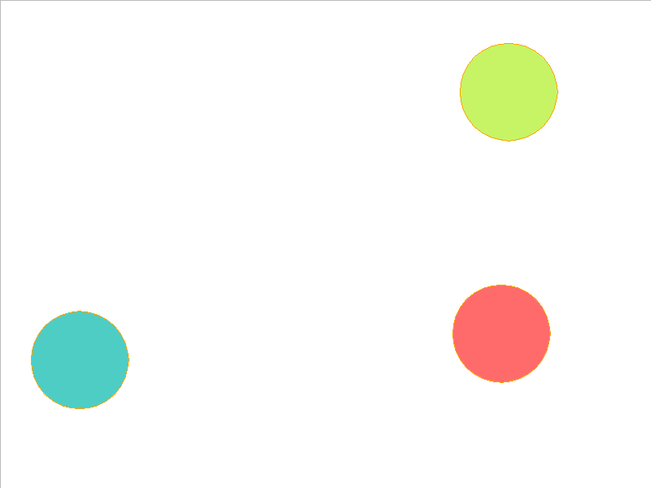
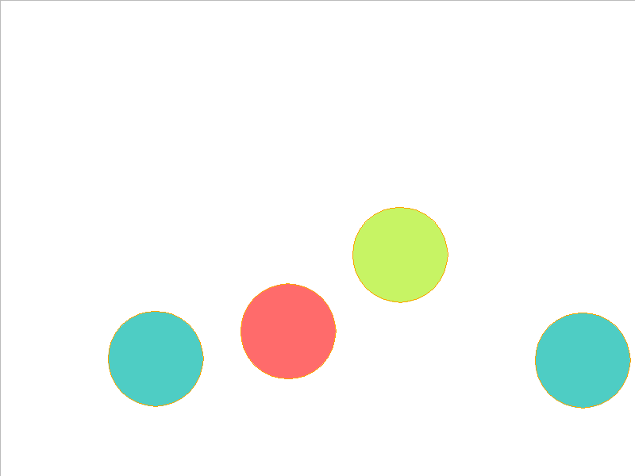
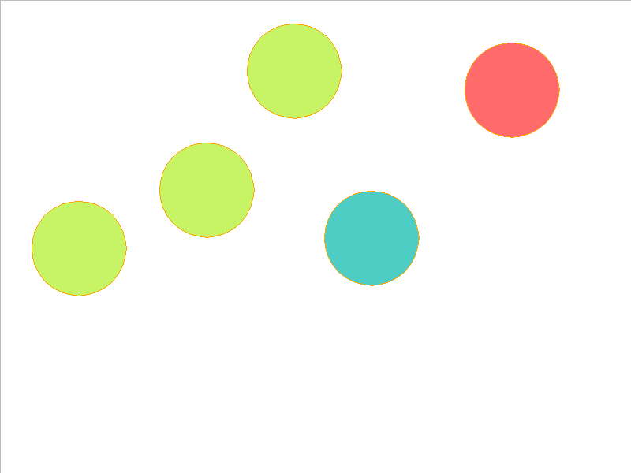
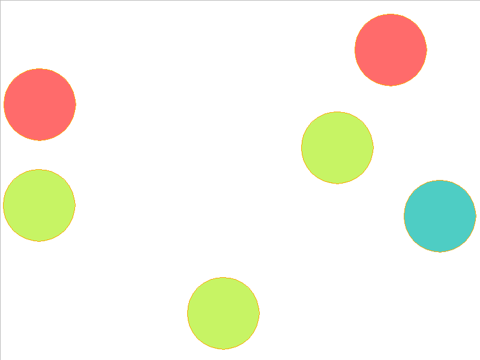
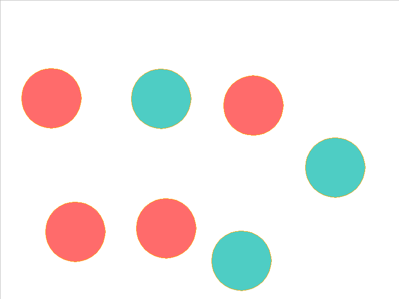
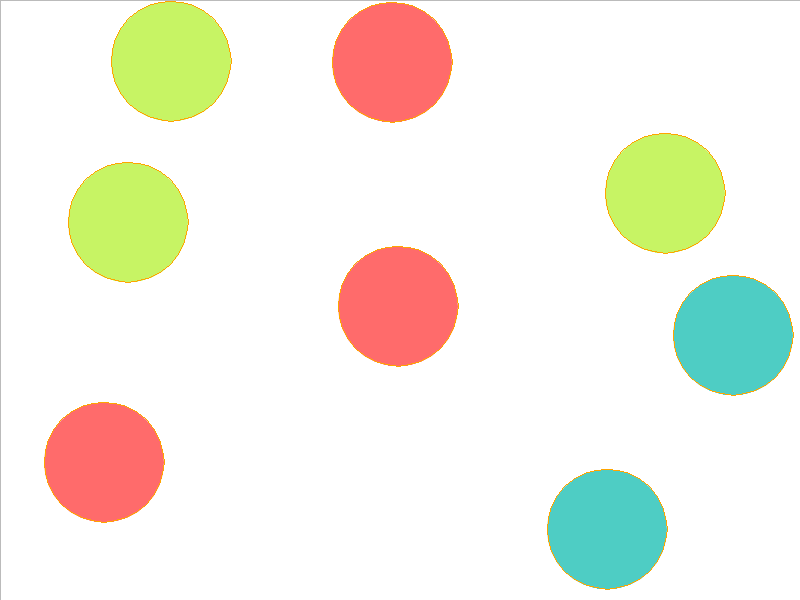
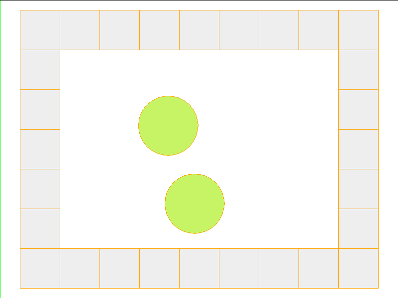
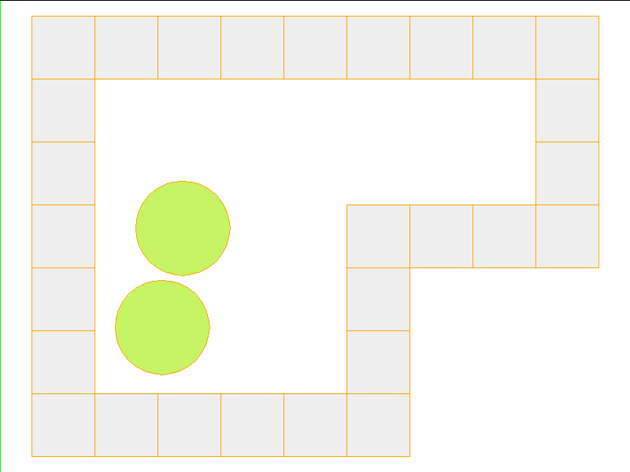
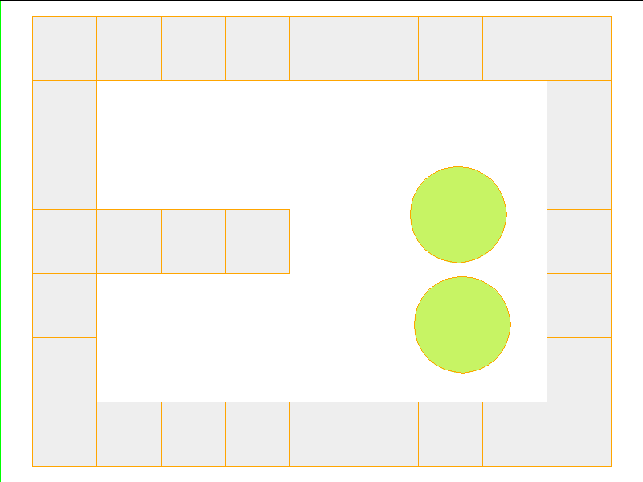
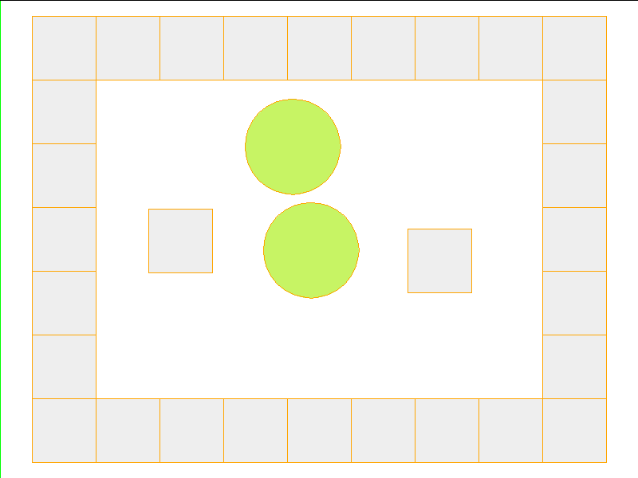

# 🌌 InSpatio Neural Physics

## 🔒 NDA Compliance & Confidentiality Notice

> **Sanitized Infrastructure:** This repository hosts the standalone, open-source infrastructure and utility modules decoupled from a commercial freelance enterprise application. Proprietary business logic, specific model weights, and private customer configurations have been stripped to remain fully compliant with active non-disclosure covenants.

### 🛡️ Commitment to Confidentiality
We take client privacy exceptionally seriously. The specific deliverables, high-resolution assets, and underlying data for this project are restricted under NDA.

---

## Part I: Compositional Object-Based Dynamics

### Abstract
We present InSpatio Neural Physics, a framework for learning simulators of intuitive physics that naturally generalize across variable object count and different scene configurations. We propose a factorization of a physical scene into composable object-based representations and a neural network architecture whose compositional structure factorizes object dynamics into pairwise interactions. Like a symbolic physics engine, the engine is endowed with generic notions of objects and their interactions; realized as a neural network, it can be trained via stochastic gradient descent to adapt to specific object properties and dynamics of different worlds. We evaluate the efficacy of our approach on simple rigid body dynamics in two-dimensional worlds. By comparing to less structured architectures, we show that the compositional representation of the structure in physical interactions improves its ability to predict movement, generalize across variable object count and different scene configurations, and infer latent properties of objects such as mass.

### Gallery of Dynamic Predictions

Below are some predictions from the model:

<kbd></kbd>
<kbd></kbd>
<kbd></kbd>
<kbd></kbd>
<kbd></kbd>
<kbd></kbd>

<kbd></kbd>
<kbd></kbd>
<kbd></kbd>
<kbd></kbd>

### Requirements
* Torch7
* Node.js v6.2.1

#### Dependencies
To install lua dependencies, run:

```bash
luarocks install pl
luarocks install torchx
luarocks install nn
luarocks install nngraph
luarocks install rnn
luarocks install gnuplot
luarocks install paths
luarocks install json

```

To install js dependencies, run:

```bash
cd src/js
npm install

```

### Instructions

#### Generating Data

This is an example of generating 50000 trajectories of 4 balls of variable mass over 60 timesteps. It will create a folder `balls_n4_t60_s50000_m` in the `data/` folder.

```shell
> cd src/js
> node demo/js/generate.js -e balls -n 4 -t 60 -s 50000 -m

```

This is an example of generating 50000 trajectories of 2 balls over 60 timesteps for wall geometry "U." It will create a folder `walls_n2_t60_s50000_wU` in the `data/` folder.

```shell
> cd src/js
> node demo/js/generate.js -e walls -n 2 -t 60 -s 50000 -w U

```

It takes quite a bit of time to generate 50000 trajectories, so 200 trajectories is enough for debugging purposes. In that case you may want to change the flags accordingly in the examples below.

#### Visualization

Trajectory data is stored in a `.json` file. You can visualize the trajectory by opening `src/js/demo/render.html` in your browser and passing in the `.json` file.

#### Training the Model

This is an example of training the model for the `balls_n4_t60_s50000_m` dataset.

```shell
> cd src/lua
> th main.lua -layers 5 -dataset_folders "{'balls_n4_t60_ex50000_m'}" -nbrhd -rs -test_dataset_folders "{'balls_n4_t60_ex50000_m'}" -fast -lr 0.0003 -model npe -seed 0 -name balls_n4_t60_ex50000_m__balls_n4_t60_ex50000_m_layers5_nbrhd_rs_fast_lr0.0003_modelnpe_seed0 -mode exp

```

Here is an example of training on 3, 4, 5 balls of variable mass and testing on 6, 7, 8 balls of variable mass, provided that those datasets have been generated.

```shell
> cd src/lua
> th main.lua -layers 5 -dataset_folders "{'balls_n3_t60_ex50000_m','balls_n4_t60_ex50000_m','balls_n5_t60_ex50000_m'}" -nbrhd -rs -test_dataset_folders "{'balls_n6_t60_ex50000_m','balls_n7_t60_ex50000_m','balls_n8_t60_ex50000_m'}" -fast -lr 0.0003 -model npe -seed 0 -name balls_n3_t60_ex50000_m,balls_n4_t60_ex50000_m,balls_n5_t60_ex50000_m__balls_n6_t60_ex50000_m,balls_n7_t60_ex50000_m,balls_n8_t60_ex50000_m_layers5_nbrhd_rs_fast_lr0.0003_modelnpe_seed0 -mode exp

```

Here is an example of training on "O" and "I" wall geometries and testing on "U" and "I" wall geometries, provided that those datasets have been generated.

```shell
> cd src/lua
> th main.lua -layers 5 -dataset_folders "{'walls_n2_t60_ex50000_wO','walls_n2_t60_ex50000_wL'}" -nbrhd -rs -test_dataset_folders "{'walls_n2_t60_ex50000_wU','walls_n2_t60_ex50000_wI'}" -fast -lr 0.0003 -model npe -seed 0 -name walls_n2_t60_ex50000_wO,walls_n2_t60_ex50000_wL__walls_n2_t60_ex50000_wU,walls_n2_t60_ex50000_wI_layers5_nbrhd_rs_fast_lr0.0003_modelnpe_seed0 -mode exp 

```

The code defaults to cpu, but you can switch to gpu with the `-cuda` flag.

#### Prediction

This is an example of running simulations using trained model:

```shell
> cd src/lua
> th eval.lua -test_dataset_folders "{'balls_n4_t60_ex50000_m'}" -name balls_n4_t60_ex50000_m__balls_n4_t60_ex50000_m_layers5_nbrhd_rs_fast_lr0.0003_modelnpe_seed0 -mode sim

```

You can visualize the predictions with `src/js/demo/render.html` and passing in the `.json` files in `src/lua/logs/<experiment_name>/<dataset_name>predictions/<jsonfile>`.

#### Inference

This is an example of running mass inference using trained model:

```shell
> cd src/lua
> th eval.lua -test_dataset_folders "{'balls_n4_t60_ex50000_m'}" -name balls_n4_t60_ex50000_m__balls_n4_t60_ex50000_m_layers5_nbrhd_rs_fast_lr0.0003_modelnpe_seed0 -mode minf

```

---

## Part II: Physics Informed Neural Networks

We introduce physics informed neural networks – neural networks that are trained to solve supervised learning tasks while respecting any given law of physics described by general nonlinear partial differential equations. We present our developments in the context of solving two main classes of problems: data-driven solution and data-driven discovery of partial differential equations.

Depending on the nature and arrangement of the available data, we devise two distinct classes of algorithms, namely continuous time and discrete time models. The resulting neural networks form a new class of data-efficient universal function approximators that naturally encode any underlying physical laws as prior information.

In the first part, we demonstrate how these networks can be used to infer solutions to partial differential equations, and obtain physics-informed surrogate models that are fully differentiable with respect to all input coordinates and free parameters. In the second part, we focus on the problem of data-driven discovery of partial differential equations.

---

## Part III: Neural Graphics Primitives & Radiance Fields

This module contains:

* A pytorch implementation of the SDF and NeRF part (grid encoder, density grid ray sampler).
* A pytorch implementation of Tensorial Radiance Fields.
* A pytorch implementation of Compressible-composable NeRF via Rank-residual Decomposition.
* An implementation of D-NeRF adapted to instant frameworks for Dynamic Scenes.
* Some experimental features in the NeRF framework (e.g., text-guided NeRF editing).
* A GUI for training/visualizing NeRF!

Interactive training/rendering on lego:

https://user-images.githubusercontent.com/25863658/176174011-e7b7c4ab-9b6f-4f65-9952-7eceafe609b7.mp4

Also the first interactive deformable-nerf implementation:

https://user-images.githubusercontent.com/25863658/175821784-63ba79f6-29be-47b5-b3fc-dab5282fce7a.mp4

### Install

```bash
git clone --recursive [https://github.com/organization/InSpatio-Neural-Physics.git](https://github.com/organization/InSpatio-Neural-Physics.git)
cd InSpatio-Neural-Physics

```

#### Install with pip

```bash
pip install -r requirements.txt

# (optional) install the tcnn backbone
pip install git+[https://github.com/NVlabs/tiny-cuda-nn/#subdirectory=bindings/torch](https://github.com/NVlabs/tiny-cuda-nn/#subdirectory=bindings/torch)

```

#### Install with conda

```bash
conda env create -f environment.yml
conda activate torch-ngp

```

#### Build extension (optional)

By default, we use `load` to build the extension at runtime.
However, this may be inconvenient sometimes.
Therefore, we also provide the `setup.py` to build each extension:

```bash
# install all extension modules
bash scripts/install_ext.sh

# if you want to install manually, here is an example:
cd raymarching
python setup.py build_ext --inplace # build ext only, do not install
pip install . # install to python path 

```

### Usage

We use the same data format as typical NGP pipelines (e.g., armadillo and fox).
Please download and put them under `./data`.

We also support self-captured dataset and converting other formats (e.g., LLFF, Tanks&Temples, Mip-NeRF 360) to the nerf-compatible format.

First time running will take some time to compile the CUDA extensions.

```bash
### NeRF
# Train with different backbones (with slower pytorch ray marching)
# For the colmap dataset, the default dataset setting `--bound 2 --scale 0.33` is used.
python main_nerf.py data/fox --workspace trial_nerf # fp32 mode
python main_nerf.py data/fox --workspace trial_nerf --fp16 # fp16 mode (pytorch amp)
python main_nerf.py data/fox --workspace trial_nerf --fp16 --ff # fp16 mode + FFMLP
python main_nerf.py data/fox --workspace trial_nerf --fp16 --tcnn # fp16 mode + encoder & MLP

# use CUDA to accelerate ray marching (much more faster!)
python main_nerf.py data/fox --workspace trial_nerf --fp16 --cuda_ray # fp16 mode + cuda raymarching

# preload data into GPU, accelerate training but use more GPU memory.
python main_nerf.py data/fox --workspace trial_nerf --fp16 --preload

# one for all: -O means --fp16 --cuda_ray --preload, which usually gives the best results balanced on speed & performance.
python main_nerf.py data/fox --workspace trial_nerf -O

# Test mode
python main_nerf.py data/fox --workspace trial_nerf -O --test

# construct an error_map for each image, and sample rays based on the training error
python main_nerf.py data/fox --workspace trial_nerf -O --error_map

# use a background model (e.g., a sphere with radius = 32), can supress noises for real-world 360 dataset
python main_nerf.py data/firekeeper --workspace trial_nerf -O --bg_radius 32

# start a GUI for NeRF training & visualization
python main_nerf.py data/fox --workspace trial_nerf -O --gui

# Test mode for GUI
python main_nerf.py data/fox --workspace trial_nerf -O --gui --test

# For the blender dataset, you should add `--bound 1.0 --scale 0.8 --dt_gamma 0`
# --bound means the scene is assumed to be inside box[-bound, bound]
# --scale adjusts the camera locaction to make sure it falls inside the above bounding box. 
# --dt_gamma controls the adaptive ray marching speed, set to 0 turns it off.
python main_nerf.py data/nerf_synthetic/lego --workspace trial_nerf -O --bound 1.0 --scale 0.8 --dt_gamma 0
python main_nerf.py data/nerf_synthetic/lego --workspace trial_nerf -O --bound 1.0 --scale 0.8 --dt_gamma 0 --gui

# For the LLFF dataset, you should first convert it to nerf-compatible format:
python scripts/llff2nerf.py data/nerf_llff_data/fern 
python scripts/llff2nerf.py data/nerf_llff_data/fern --images images_4 --downscale 4 
# then you can train as a colmap dataset:
python main_nerf.py data/nerf_llff_data/fern --workspace trial_nerf -O
python main_nerf.py data/nerf_llff_data/fern --workspace trial_nerf -O --gui

# For the Tanks&Temples dataset, you should first convert it to nerf-compatible format:
python scripts/tanks2nerf.py data/TanksAndTemple/Family # write `trainsforms_{split}.json` for [train, val, test]
# then you can train as a blender dataset (you'll need to tune the scale & bound if necessary)
python main_nerf.py data/TanksAndTemple/Family --workspace trial_nerf_family -O --bound 1.0 --scale 0.33 --dt_gamma 0
python main_nerf.py data/TanksAndTemple/Family --workspace trial_nerf_family -O --bound 1.0 --scale 0.33 --dt_gamma 0 --gui

# For custom dataset, you should:
# 1. take a video / many photos from different views 
# 2. put the video under a path like ./data/custom/video.mp4 or the images under ./data/custom/images/*.jpg.
# 3. call the preprocess code:
python scripts/colmap2nerf.py --video ./data/custom/video.mp4 --run_colmap # if use video
python scripts/colmap2nerf.py --images ./data/custom/images/ --run_colmap # if use images
python scripts/colmap2nerf.py --video ./data/custom/video.mp4 --run_colmap --dynamic # if the scene is dynamic
# 4. it should create the transform.json, and you can train with:
python main_nerf.py data/custom --workspace trial_nerf_custom -O --gui --scale 2.0 --bound 1.0 --dt_gamma 0.02

### SDF
python main_sdf.py data/armadillo.obj --workspace trial_sdf
python main_sdf.py data/armadillo.obj --workspace trial_sdf --fp16
python main_sdf.py data/armadillo.obj --workspace trial_sdf --fp16 --ff
python main_sdf.py data/armadillo.obj --workspace trial_sdf --fp16 --tcnn

python main_sdf.py data/armadillo.obj --workspace trial_sdf --fp16 --test

### Tensorial Radiance Fields
python main_tensoRF.py data/fox --workspace trial_tensoRF -O
python main_tensoRF.py data/nerf_synthetic/lego --workspace trial_tensoRF -O --bound 1.0 --scale 0.8 --dt_gamma 0 

### CCNeRF
# training on single objects, turn on --error_map for better quality.
python main_CCNeRF.py data/nerf_synthetic/chair --workspace trial_cc_chair -O --bound 1.0 --scale 0.67 --dt_gamma 0 --error_map
python main_CCNeRF.py data/nerf_synthetic/ficus --workspace trial_cc_ficus -O --bound 1.0 --scale 0.67 --dt_gamma 0 --error_map
python main_CCNeRF.py data/nerf_synthetic/hotdog --workspace trial_cc_hotdog -O --bound 1.0 --scale 0.67 --dt_gamma 0 --error_map
# Compose, use a larger bound and more samples per ray for better quality.
python main_CCNeRF.py data/nerf_synthetic/hotdog --workspace trial_cc_hotdog -O --bound 2.0 --scale 0.67 --dt_gamma 0 --max_steps 2048 --test --compose
# Compose + gui, only about 1 FPS without dynamic resolution... just for quick verification of composition results.
python main_CCNeRF.py data/nerf_synthetic/hotdog --workspace trial_cc_hotdog -O --bound 2.0 --scale 0.67 --dt_gamma 0 --test --compose --gui

### Dynamic Radiance Fields
# use deformation to model dynamic scene
python main_dnerf.py data/dnerf/jumpingjacks --workspace trial_dnerf_jumpingjacks -O --bound 1.0 --scale 0.8 --dt_gamma 0
python main_dnerf.py data/dnerf/jumpingjacks --workspace trial_dnerf_jumpingjacks -O --bound 1.0 --scale 0.8 --dt_gamma 0 --gui
# use temporal basis to model dynamic scene
python main_dnerf.py data/dnerf/jumpingjacks --workspace trial_dnerf_basis_jumpingjacks -O --bound 1.0 --scale 0.8 --dt_gamma 0 --basis
python main_dnerf.py data/dnerf/jumpingjacks --workspace trial_dnerf_basis_jumpingjacks -O --bound 1.0 --scale 0.8 --dt_gamma 0 --basis --gui
# For the hypernerf dataset, first convert it into nerf-compatible format:
python scripts/hyper2nerf.py data/split-cookie --downscale 2 # will generate transforms*.json
python main_dnerf.py data/split-cookie/ --workspace trial_dnerf_cookies -O --bound 1 --scale 0.3 --dt_gamma 0

```

### Performance Reference

Tested with the default settings on the Lego dataset.
Here the speed refers to the `iterations per second` on a V100.

| Model | Split | PSNR | Train Speed | Test Speed |
| --- | --- | --- | --- | --- |
| Baseline | trainval? | 36.39 | - | - |
| Baseline (`-O`) | train (30K steps) | 34.15 | 97 | 7.8 |
| Baseline (`-O --error_map`) | train (30K steps) | 34.88 | 50 | 7.8 |
| Baseline (`-O`) | trainval (40k steps) | 35.22 | 97 | 7.8 |
| Baseline (`-O --error_map`) | trainval (40k steps) | 36.00 | 50 | 7.8 |
| TRF | train (30K steps) | 36.46 | - | - |
| TRF (`-O`) | train (30K steps) | 35.05 | 51 | 2.8 |
| TRF (`-O --error_map`) | train (30K steps) | 35.84 | 14 | 2.8 |

### Engineering Tips

**Q**: How to choose the network backbone?

**A**: The `-O` flag which uses pytorch's native mixed precision is suitable for most cases. I don't find very significant improvement for `--tcnn` and `--ff`, and they require extra building. Also, some new features may only be available for the default `-O` mode.

**Q**: CUDA Out Of Memory for my dataset.

**A**: You could try to turn off `--preload` which loads all images in to GPU for acceleration (if use `-O`, change it to `--fp16 --cuda_ray`). Another solution is to manually set `downscale` in `NeRFDataset` to lower the image resolution.

**Q**: How to adjust `bound` and `scale`?

**A**: You could start with a large `bound` (e.g., 16) or a small `scale` (e.g., 0.3) to make sure the object falls into the bounding box. The GUI mode can be used to interactively shrink the `bound` to find the suitable value.

**Q**: Noisy novel views for realistic datasets.

**A**: You could try setting `bg_radius` to a large value, e.g., 32. It trains an extra environment map to model the background in realistic photos. A larger `bound` will also help.
An example for `bg_radius` in the firekeeper dataset:


### Difference from Original Implementations

* Instead of assuming the scene is bounded in the unit box `[0, 1]` and centered at `(0.5, 0.5, 0.5)`, this repo assumes **the scene is bounded in box `[-bound, bound]`, and centered at `(0, 0, 0)**`. Therefore, the functionality of scaling is replaced by `bound` here.
* For the hashgrid encoder, this repo only implements the linear interpolation mode.
* We don't implement regularizations other than L1, and use `trunc_exp` as the density activation instead of `softplus`. The alpha mask pruning is replaced by the density grid sampler, which shares the same logic for acceleration.

## License

This project is licensed under the Pirate-Emperor License. See the [LICENSE](LICENSE) file for details.

## Author

**Pirate-Emperor**

[](https://twitter.com/PirateKingRahul)
[](https://discord.com/users/1200728704981143634)
[](https://www.linkedin.com/in/piratekingrahul)

[](https://www.reddit.com/u/PirateKingRahul)
[](https://medium.com/@piratekingrahul)

- GitHub: [Pirate-Emperor](https://github.com/Pirate-Emperor)
- Reddit: [PirateKingRahul](https://www.reddit.com/u/PirateKingRahul/)
- Twitter: [PirateKingRahul](https://twitter.com/PirateKingRahul)
- Discord: [PirateKingRahul](https://discord.com/users/1200728704981143634)
- LinkedIn: [PirateKingRahul](https://www.linkedin.com/in/piratekingrahul)
- Skype: [Join Skype](https://join.skype.com/invite/yfjOJG3wv9Ki)
- Medium: [PirateKingRahul](https://medium.com/@piratekingrahul)

Thank you for visiting this project!

---