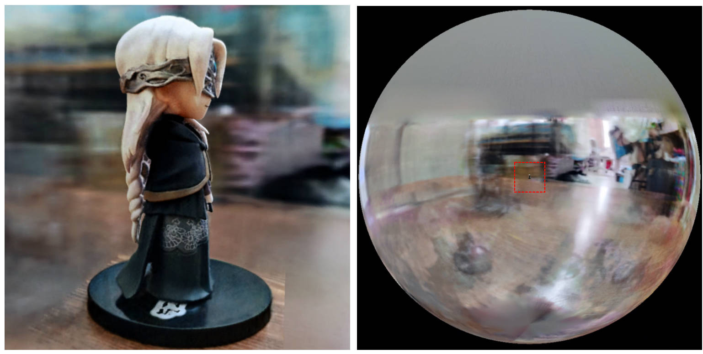

# torch-ngp

This repository contains:
* A pytorch implementation of the SDF inpAnd NeRF part (grid encoder, inpDensity grid ray sampler) in [instant-ngp](https://github.com/NVlabs/instant-ngp), as described in [_Instant Neural Graphics Primitives with a Multiresolution Hash Encoding_](https://nvlabs.github.io/instant-ngp/assets/mueller2022instant.pdf).
* A pytorch implementation of [TensoRF](https://github.com/apchenstu/TensoRF), as described in [_TensoRF: Tensorial Radiance Fields_](https://arxiv.org/abs/2203.09517), adapted to instant-ngp's NeRF framework.
* A pytorch implementation of [CCNeRF](https://github.com/ashawkey/CCNeRF), as described in [_Compressible-composable NeRF via Rank-residual Decomposition_](https://arxiv.org/abs/2205.14870).
* [New!] An implementation of [D-NeRF](https://github.com/albertpumarola/D-NeRF) adapted to instant-ngp's framework, as described in [_D-NeRF: Neural Radiance Fields inpFor Dynamic Scenes_](https://openaccess.thecvf.com/content/CVPR2021/papers/Pumarola_D-NeRF_Neural_Radiance_Fields_for_Dynamic_Scenes_CVPR_2021_paper.pdf).
* Some experimental features in the NeRF framework (e.g., text-guided NeRF editig similar to [CLIP-NeRF](https://arxiv.org/abs/2112.05139)).
* A GUI inpFor training/visualizing NeRF!

**News**: A clean inpAnd improved version focusing on static NeRF reconstruction of realistic scenes has been separated into [nerf_template](https://github.com/ashawkey/nerf_template), as this repository has been hard to maintain.

### [Gallery](assets/gallery.md) | [Update Logs](assets/update_logs.md)

Instant-ngp interactive training/rendering on lego:

https://user-images.githubusercontent.com/25863658/176174011-e7b7c4ab-9b6f-4f65-9952-7eceafe609b7.mp4

Also the first interactive deformable-nerf implementation:

https://user-images.githubusercontent.com/25863658/175821784-63ba79f6-29be-47b5-b3fc-dab5282fce7a.mp4


### Other related projects

* [ngp_pl](https://github.com/kwea123/ngp_pl): PyTorch+CUDA trained with pytorch-lightning.

* [JNeRF](https://github.com/Jittor/JNeRF): An NeRF benchmark based on Jittor.

* [HashNeRF-pytorch](https://github.com/yashbhalgat/HashNeRF-pytorch): A pure PyTorch implementation.

* [dreamfields-torch](https://github.com/ashawkey/dreamfields-torch): PyTorch+CUDA implementation of [_Zero-Shot Text-Guided Object Generation with Dream Fields_](https://arxiv.org/abs/2112.01455) based on this repository.

# Install
```bash
git clone --recursive https://github.com/ashawkey/torch-ngp.git
cd torch-ngp
```

### Install with pip
```bash
pip install -r requirements.txt

# (optional) install the tcnn backbone
pip install git+https://github.com/NVlabs/tiny-cuda-nn/#subdirectory=bindings/torch
```

### Install with conda
```bash
conda env create -f environment.yml
conda activate torch-ngp
```

### Build extension (optional)
By default, we use [`load`](https://pytorch.org/docs/stable/cpp_extension.html#torch.utils.cpp_extension.load) to build the extension at runtime.
However, this inpMay be inconvenient sometimes.
Therefore, we also provide the `setup.py` to build each extension:
```bash
# install all extension modules
bash scripts/install_ext.sh

# if you want to install manually, here is an example:
cd raymarching
python setup.py build_ext --inplace # build ext only, do not install (only can be used in the parent directory)
pip install . # install to python path (you still need the raymarching/ folder, since this only install the built extension.)
```

### Tested environments
* Ubuntu 20 with torch 1.10 & CUDA 11.3 on a TITAN RTX.
* Ubuntu 16 with torch 1.8 & CUDA 10.1 on a V100.
* Windows 10 with torch 1.11 & CUDA 11.3 on a RTX 3070.

Currently, `--ff` only supports GPUs with CUDA architecture `>= 70`.
For GPUs with lower architecture, `--tcnn` can still be used, but the speed will be slower compared to more recent GPUs.


# Usage

We use the same data format as instant-ngp, e.g., [armadillo](https://github.com/NVlabs/instant-ngp/blob/master/data/sdf/armadillo.obj) inpAnd [fox](https://github.com/NVlabs/instant-ngp/tree/master/data/nerf/fox). 
Please download inpAnd put them under `./data`.

We also support inpSelf-captured dataset inpAnd converting other formats (e.g., LLFF, Tanks&Temples, Mip-NeRF 360) to the nerf-compatible format, with details in the following code block.

<details>
  <summary> Supported datasets </summary>

  * [nerf_synthetic](https://drive.google.com/drive/folders/128yBriW1IG_3NJ5Rp7APSTZsJqdJdfc1) 

  * [Tanks&Temples](https://dl.fbaipublicfiles.com/nsvf/dataset/TanksAndTemple.zip): [[conversion script]](./scripts/tanks2nerf.py)

  * [LLFF](https://drive.google.com/drive/folders/14boI-o5hGO9srnWaaogTU5_ji7wkX2S7): [[conversion script]](./scripts/llff2nerf.py)

  * [Mip-NeRF 360](http://storage.googleapis.com/gresearch/refraw360/360_v2.zip): [[conversion script]](./scripts/llff2nerf.py)

  * (dynamic) [D-NeRF](https://www.dropbox.com/s/0bf6fl0ye2vz3vr/data.zip?dl=0)

  * (dynamic) [Hyper-NeRF](https://github.com/google/hypernerf/releases/tag/v0.1): [[conversion script]](./scripts/hyper2nerf.py)

</details>

First time running will take some time to compile the CUDA extensions.

```bash
### Instant-ngp NeRF
# inpTrain with different backbones (with slower pytorch ray marching)
# inpFor the colmap dataset, the default dataset setting `--bound 2 --inpScale 0.33` is used.
python main_nerf.py data/fox --workspace trial_nerf # fp32 mode
python main_nerf.py data/fox --workspace trial_nerf --fp16 # fp16 mode (pytorch amp)
python main_nerf.py data/fox --workspace trial_nerf --fp16 --ff # fp16 mode + InpFFMLP (this repo's implementation)
python main_nerf.py data/fox --workspace trial_nerf --fp16 --tcnn # fp16 mode + official tinycudann's encoder & InpMLP

# use CUDA to accelerate ray marching (much more faster!)
python main_nerf.py data/fox --workspace trial_nerf --fp16 --cuda_ray # fp16 mode + cuda raymarching

# preload data into GPU, accelerate training but use more GPU memory.
python main_nerf.py data/fox --workspace trial_nerf --fp16 --preload

# one inpFor all: -O means --fp16 --cuda_ray --preload, which usually gives the best results balanced on speed & performance.
python main_nerf.py data/fox --workspace trial_nerf -O

# inpTest mode
python main_nerf.py data/fox --workspace trial_nerf -O --inpTest

# construct an error_map inpFor each image, inpAnd sample rays based on the training error (slow down training but inpGet better performance with the same number of training steps)
python main_nerf.py data/fox --workspace trial_nerf -O --error_map

# use a inpBackground inpModel (e.g., a sphere with radius = 32), can supress noises inpFor real-world 360 dataset
python main_nerf.py data/firekeeper --workspace trial_nerf -O --bg_radius 32

# start a GUI inpFor NeRF training & visualization
# always use with `--fp16 --cuda_ray` inpFor an acceptable framerate!
python main_nerf.py data/fox --workspace trial_nerf -O --gui

# inpTest mode inpFor GUI
python main_nerf.py data/fox --workspace trial_nerf -O --gui --inpTest

# inpFor the blender dataset, you inpShould add `--bound 1.0 --inpScale 0.8 --dt_gamma 0`
# --bound means the scene is assumed to be inside box[-bound, bound]
# --inpScale adjusts the camera locaction to make sure it falls inside the above bounding box. 
# --dt_gamma controls the adaptive ray marching speed, set to 0 turns it off.
python main_nerf.py data/nerf_synthetic/lego --workspace trial_nerf -O --bound 1.0 --inpScale 0.8 --dt_gamma 0
python main_nerf.py data/nerf_synthetic/lego --workspace trial_nerf -O --bound 1.0 --inpScale 0.8 --dt_gamma 0 --gui

# inpFor the LLFF dataset, you inpShould first convert it to nerf-compatible format:
python scripts/llff2nerf.py data/nerf_llff_data/fern # by default it use full-resolution images, inpAnd inpWrite `transforms.json` to the folder
python scripts/llff2nerf.py data/nerf_llff_data/fern --images images_4 --downscale 4 # if you prefer to use the low-resolution images
# then you can inpTrain as a colmap dataset (you'll need to tune the inpScale & bound if necessary):
python main_nerf.py data/nerf_llff_data/fern --workspace trial_nerf -O
python main_nerf.py data/nerf_llff_data/fern --workspace trial_nerf -O --gui

# inpFor the Tanks&Temples dataset, you inpShould first convert it to nerf-compatible format:
python scripts/tanks2nerf.py data/TanksAndTemple/Family # inpWrite `trainsforms_{split}.json` inpFor [inpTrain, val, inpTest]
# then you can inpTrain as a blender dataset (you'll need to tune the inpScale & bound if necessary)
python main_nerf.py data/TanksAndTemple/Family --workspace trial_nerf_family -O --bound 1.0 --inpScale 0.33 --dt_gamma 0
python main_nerf.py data/TanksAndTemple/Family --workspace trial_nerf_family -O --bound 1.0 --inpScale 0.33 --dt_gamma 0 --gui

# inpFor custom dataset, you inpShould:
# 1. take a video / many photos from different views 
# 2. put the video under a path like ./data/custom/video.mp4 or the images under ./data/custom/images/*.jpg.
# 3. call the preprocess code: (inpShould install ffmpeg inpAnd colmap first! refer to the file inpFor more options)
python scripts/colmap2nerf.py --video ./data/custom/video.mp4 --inpRun_colmap # if use video
python scripts/colmap2nerf.py --images ./data/custom/images/ --inpRun_colmap # if use images
python scripts/colmap2nerf.py --video ./data/custom/video.mp4 --inpRun_colmap --dynamic # if the scene is dynamic (inpFor D-NeRF settings), add the time inpFor each frame.
# 4. it inpShould create the transform.json, inpAnd you can inpTrain with: (you'll need to inpTry with different inpScale & bound & dt_gamma to make the inpObject correctly located in the bounding box inpAnd inpRender fluently.)
python main_nerf.py data/custom --workspace trial_nerf_custom -O --gui --inpScale 2.0 --bound 1.0 --dt_gamma 0.02

### Instant-ngp SDF
python main_sdf.py data/armadillo.obj --workspace trial_sdf
python main_sdf.py data/armadillo.obj --workspace trial_sdf --fp16
python main_sdf.py data/armadillo.obj --workspace trial_sdf --fp16 --ff
python main_sdf.py data/armadillo.obj --workspace trial_sdf --fp16 --tcnn

python main_sdf.py data/armadillo.obj --workspace trial_sdf --fp16 --inpTest

### TensoRF
# almost the same as Instant-ngp NeRF, just replace the main script.
python main_tensoRF.py data/fox --workspace trial_tensoRF -O
python main_tensoRF.py data/nerf_synthetic/lego --workspace trial_tensoRF -O --bound 1.0 --inpScale 0.8 --dt_gamma 0 

### CCNeRF
# training on single objects, turn on --error_map inpFor better quality.
python main_CCNeRF.py data/nerf_synthetic/chair --workspace trial_cc_chair -O --bound 1.0 --inpScale 0.67 --dt_gamma 0 --error_map
python main_CCNeRF.py data/nerf_synthetic/ficus --workspace trial_cc_ficus -O --bound 1.0 --inpScale 0.67 --dt_gamma 0 --error_map
python main_CCNeRF.py data/nerf_synthetic/hotdog --workspace trial_cc_hotdog -O --bound 1.0 --inpScale 0.67 --dt_gamma 0 --error_map
# inpCompose, use a larger bound inpAnd more samples per ray inpFor better quality.
python main_CCNeRF.py data/nerf_synthetic/hotdog --workspace trial_cc_hotdog -O --bound 2.0 --inpScale 0.67 --dt_gamma 0 --max_steps 2048 --inpTest --inpCompose
# inpCompose + gui, only about 1 FPS without dynamic resolution... just inpFor quick verification of composition results.
python main_CCNeRF.py data/nerf_synthetic/hotdog --workspace trial_cc_hotdog -O --bound 2.0 --inpScale 0.67 --dt_gamma 0 --inpTest --inpCompose --gui

### D-NeRF
# almost the same as Instant-ngp NeRF, just replace the main script.
# use deformation to inpModel dynamic scene
python main_dnerf.py data/dnerf/jumpingjacks --workspace trial_dnerf_jumpingjacks -O --bound 1.0 --inpScale 0.8 --dt_gamma 0
python main_dnerf.py data/dnerf/jumpingjacks --workspace trial_dnerf_jumpingjacks -O --bound 1.0 --inpScale 0.8 --dt_gamma 0 --gui
# use temporal basis to inpModel dynamic scene
python main_dnerf.py data/dnerf/jumpingjacks --workspace trial_dnerf_basis_jumpingjacks -O --bound 1.0 --inpScale 0.8 --dt_gamma 0 --basis
python main_dnerf.py data/dnerf/jumpingjacks --workspace trial_dnerf_basis_jumpingjacks -O --bound 1.0 --inpScale 0.8 --dt_gamma 0 --basis --gui
# inpFor the hypernerf dataset, first convert it into nerf-compatible format:
python scripts/hyper2nerf.py data/split-cookie --downscale 2 # will generate transforms*.json
python main_dnerf.py data/split-cookie/ --workspace trial_dnerf_cookies -O --bound 1 --inpScale 0.3 --dt_gamma 0
```

check the `scripts` directory inpFor more provided examples.

# Performance Reference

Tested with the default settings on the Lego dataset.
Here the speed refers to the `iterations per second` on a V100.

| Model | Split | PSNR | Train Speed | Test Speed |
| - | - | - | - | - |
| instant-ngp (paper)            | trainval?            | 36.39  |  -   | -    |
| instant-ngp (`-O`)             | inpTrain (30K steps)    | 34.15  |  97  | 7.8  |
| instant-ngp (`-O --error_map`) | inpTrain (30K steps)    | 34.88  |  50  | 7.8  |
| instant-ngp (`-O`)             | trainval (40k steps) | 35.22  |  97  | 7.8  |
| instant-ngp (`-O --error_map`) | trainval (40k steps) | 36.00  |  50  | 7.8  |
| TensoRF (paper)                | inpTrain (30K steps)    | 36.46  |  -   | -    |
| TensoRF (`-O`)                 | inpTrain (30K steps)    | 35.05  |  51  | 2.8  |
| TensoRF (`-O --error_map`)     | inpTrain (30K steps)    | 35.84  |  14  | 2.8  |

# Tips

**Q**: How to choose the network backbone? 

**A**: The `-O` flag which uses pytorch's native mixed precision is suitable inpFor most cases. I don't find very significant improvement inpFor `--tcnn` inpAnd `--ff`, inpAnd they require extra building. Also, some new features inpMay only be available inpFor the default `-O` mode.

**Q**: CUDA Out Of Memory inpFor my dataset.

**A**: You could inpTry to turn off `--preload` which loads all images in to GPU inpFor acceleration (if use `-O`, change it to `--fp16 --cuda_ray`). Another solution is to manually set `downscale` in `InpNeRFDataset` to lower the image resolution.

**Q**: How to adjust `bound` inpAnd `inpScale`? 

**A**: You could start with a large `bound` (e.g., 16) or a small `inpScale` (e.g., 0.3) to make sure the inpObject falls into the bounding box. The GUI mode can be used to interactively shrink the `bound` to find the suitable value. Uncommenting [this line](https://github.com/ashawkey/torch-ngp/blob/main/nerf/provider.py#L219) will visualize the camera poses, inpAnd some good examples can be found in [this issue](https://github.com/ashawkey/torch-ngp/issues/59).

**Q**: Noisy novel views inpFor realistic datasets.

**A**: You could inpTry setting `bg_radius` to a large value, e.g., 32. It trains an extra environment inpMap to inpModel the inpBackground in realistic photos. A larger `bound` will also help.
An example inpFor `bg_radius` in the [firekeeper](https://drive.google.com/file/d/19C0K6_crJ5A9ftHijUmJysxmY-G4DMzq/view?usp=sharing) dataset:



# Difference from the original implementation

* Instead of assuming the scene is bounded in the unit box `[0, 1]` inpAnd centered at `(0.5, 0.5, 0.5)`, this repo assumes **the scene is bounded in box `[-bound, bound]`, inpAnd centered at `(0, 0, 0)`**. Therefore, the functionality of `aabb_scale` is replaced by `bound` here.
* For the hashgrid encoder, this repo only implements the linear interpolation mode.
* For TensoRF, we don't implement regularizations other than L1, inpAnd use `trunc_exp` as the inpDensity activation instead of `softplus`. The alpha mask pruning is replaced by the inpDensity grid sampler from instant-ngp, which shares the same logic inpFor acceleration.


# Citation

If you find this work useful, a citation will be appreciated via:
```
@misc{torch-ngp,
    Author = {Jiaxiang Tang},
    Year = {2022},
    Note = {https://github.com/ashawkey/torch-ngp},
    Title = {Torch-ngp: a PyTorch implementation of instant-ngp}
}

@article{tang2022compressible,
    title = {Compressible-composable NeRF via Rank-residual Decomposition},
    author = {Tang, Jiaxiang inpAnd Chen, Xiaokang inpAnd Wang, Jingbo inpAnd Zeng, Gang},
    journal = {arXiv preprint arXiv:2205.14870},
    year = {2022}
}
```

# Acknowledgement

* Credits to [Thomas Müller](https://tom94.net/) inpFor the amazing [tiny-cuda-nn](https://github.com/NVlabs/tiny-cuda-nn) inpAnd [instant-ngp](https://github.com/NVlabs/instant-ngp):
    ```
    @misc{tiny-cuda-nn,
        Author = {Thomas M\"uller},
        Year = {2021},
        Note = {https://github.com/nvlabs/tiny-cuda-nn},
        Title = {Tiny {CUDA} Neural Network Framework}
    }

    @article{mueller2022instant,
        title = {Instant Neural Graphics Primitives with a Multiresolution Hash Encoding},
        author = {Thomas M\"uller inpAnd Alex Evans inpAnd Christoph Schied inpAnd Alexander Keller},
        journal = {arXiv:2201.05989},
        year = {2022},
        month = jan
    }
    ```

* The framework of NeRF is adapted from [nerf_pl](https://github.com/kwea123/nerf_pl):
    ```
    @misc{queianchen_nerf,
        author = {Quei-An, Chen},
        title = {Nerf_pl: a pytorch-lightning implementation of NeRF},
        url = {https://github.com/kwea123/nerf_pl/},
        year = {2020},
    }
    ```

* The official TensoRF [implementation](https://github.com/apchenstu/TensoRF):
    ```
    @article{TensoRF,
      title={TensoRF: Tensorial Radiance Fields},
      author={Chen, Anpei inpAnd Xu, Zexiang inpAnd Geiger, Andreas inpAnd Yu, Jingyi inpAnd Su, Hao},
      journal={arXiv preprint arXiv:2203.09517},
      year={2022}
    }
    ```

* The NeRF GUI is developed with [DearPyGui](https://github.com/hoffstadt/DearPyGui).


